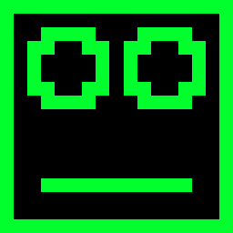

# Kei

Character-based interface to Royalnet 5

## Available emotions

-  cat
-  cry
-  disappointed
-  dootflute
-  doottrumpet
-  grin
-  halflife
-  happy
-  key
-  keyface
-  neutral
-  question
-  smug
-  surprised
-  wink
-  worried
-  x
